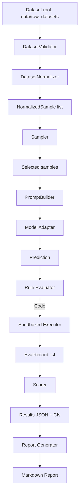

# Architecture

## High-level design

The system is a **production-ready benchmarking pipeline** with statistical rigor and security features:

- data ingestion/normalization
- stratified sampling with determinism
- domain-specific prompting with refusal prevention
- rule-based evaluation with sandboxed code execution
- statistical scoring with 95% confidence intervals
- comprehensive analysis and reporting tools

No AI-based evaluator is used for grading; all evaluation is deterministic.

## Component diagram



## Runtime entrypoints

- Programmatic API: `Benchmark` class in `benchmark_lib/benchmark.py`
- CLI: `run_benchmark.py` (with --compare, --dry-run support)
- Analysis tools: `analyze_errors.py`, `save_sample_list.py`, `mcnemar_test.py`, `generate_report.py`, `validate_pipeline.py`

## Package structure

### Core Benchmark Engine
- `benchmark_lib/dataset`
  : Validation, parsing, normalization, and difficulty tagging
  - `validator.py` - Dataset folder and structure validation
  - `normalizer.py` - Mixed-format data loading (HF disk, CSV, JSON, riegeli)
  - `difficulty.py` - Heuristic difficulty tagging
- `benchmark_lib/engine`
  : Sampling, prompting, inference, evaluation, and scoring
  - `benchmark.py` - Main orchestration and pipeline
  - `sampler.py` - Deterministic stratified sampling
  - `prompt_builder.py` - Domain-specific prompt construction with refusal prevention
  - `runner.py` - Inference loop with caching, retry, timing
  - `evaluator.py` - Rule-based grading with F1 tuning and sandboxed execution
  - `scorer.py` - Results aggregation with 95% Wilson score intervals
  - `sandboxed_eval.py` - **NEW** Multi-layer code execution protection (pattern validation, subprocess isolation, timeout)
- `benchmark_lib/models`
  : Provider-agnostic model interface and concrete adapters
  - `base_model.py` - Abstract base class for all models
  - `_rate_limit.py` - Rate limiting utilities
  - `openai_model.py` - OpenAI API adapter
  - `openrouter_model.py` - OpenRouter API adapter
  - `local_model.py` - Local OpenAI-compatible endpoints (Ollama)
  - `huggingface_model.py` - Hugging Face models (local + Inference API)
  - `gemini_model.py` - Google Gemini API adapter
  - `together_model.py` - Together API adapter
  - `groq_model.py` - Groq with local throttling
- `benchmark_lib/utils`
  : Cache, logger setup, and shared dataclasses
  - `types.py` - Data classes (NormalizedSample, EvalRecord)
  - `cache.py` - Prompt response caching with validation
  - `logging.py` - Logger configuration

### Analysis & Reporting Utilities
- `analyze_errors.py` - **NEW** Error categorization into 8 types
- `generate_report.py` - **NEW** Markdown report generation with per-domain breakdown
- `save_sample_list.py` - **NEW** Sample extraction with metadata
- `mcnemar_test.py` - **NEW** Statistical significance testing for model comparison
- `validate_pipeline.py` - **NEW** Evaluator correctness testing (43/43 tests passing)

## Primary data contracts

- `NormalizedSample`
  : Canonical benchmark sample used by the pipeline
  - Includes: id, question, expected, dataset, domain, difficulty
- `EvalRecord`
  : Captures per-question evaluation details
  - Includes: prediction, correctness, error, elapsed_seconds, tokens, prompt text
- `BenchmarkResult`
  : Final aggregated results with statistics
  - Includes: accuracy per domain, weighted final score, 95% CIs, error breakdown, timing metrics

Defined in `benchmark_lib/utils/types.py`.

## Determinism strategy

- Deterministic RNG seeding in sampler (configurable via --seed/--seeds)
- Explicit mode sizes (quick=10%, half=50%, full=100%)
- Explicit domain weights (math=0.25, logic=0.25, knowledge=0.35, code=0.15)
- Fixed difficulty ratio targets (easy:medium:hard = roughly 40:40:20)
- Deterministic non-LLM evaluation logic with bounded normalization rules
- Reproducible prompt text (stored in JSONL for verification)

## Statistical Methods

### Confidence Intervals
- **Wilson Score** method for 95% CIs
- Computed per: domain, difficulty tier, dataset
- Equation: `(p + z²/2n) ± z√(p(1-p)/n + z²/4n²) / (1 + z²/n)`
  - p = accuracy, n = sample count, z = 1.96 (95% confidence)

### Model Comparison
- **McNemar's Test** for paired samples
- Chi-squared statistic: `(|b-c|-1)² / (b+c)`
  - b = disagreements favoring Model 1, c = disagreements favoring Model 2
- P-value significance at α=0.05

## Domain Model

Supported domains:

- **Math** (25% weight): GSM8K, MATHÉ, SVAMP
- **Logic** (25% weight): Reclor, ProofWriter
- **Knowledge** (35% weight): SQuAD, NQ, TriviaQA
- **Code** (15% weight): MBPP, HumanEval

Final score formula:
```
score = Σ(domain_accuracy[d] × domain_weight[d]) for d in {math, logic, knowledge, code}
```

## Security & Sandboxing

### Code Execution Protection (3 layers)
1. **Pattern validation** - Blocks exec, eval, file ops, system commands
2. **Subprocess isolation** - Code runs in separate process with timeout
3. **Configurable limits** - Output truncation, token limits, memory bounds

### Implementation
- File: `benchmark_lib/engine/sandboxed_eval.py`
- Sandboxed execution is enabled by default; optional strict mode adds extra restrictions
- Timeout handling with graceful degradation

