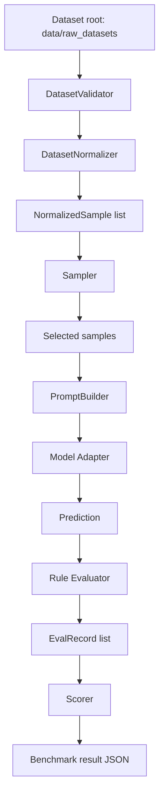

# Architecture

## High-level design

The system is a deterministic benchmarking pipeline with a strict separation between:

- data ingestion/normalization
- sampling
- prompting + model inference
- rule-based evaluation
- scoring/aggregation

No AI-based evaluator is used for grading.

## Component diagram

## Runtime entrypoints

- Programmatic API: `Benchmark` class in `benchmark_lib/benchmark.py`
- CLI: `run_benchmark.py`

## Package structure

- `benchmark_lib/dataset`
: Validation, parsing, normalization, and difficulty tagging.
- `benchmark_lib/engine`
: Sampling, prompting, model execution, evaluation, and scoring.
- `benchmark_lib/models`
: Provider-agnostic model interface and concrete adapters.
- `benchmark_lib/utils`
: Cache, logger setup, and shared dataclasses.

## Primary data contracts

- `NormalizedSample`
: Canonical benchmark sample used by the pipeline.
- `EvalRecord`
: Captures per-question prompt/prediction/expected/correct/error/cost.

Defined in `benchmark_lib/utils/types.py`.

## Determinism strategy

- deterministic RNG seeding in sampler
- explicit mode sizes
- explicit domain weights
- fixed difficulty ratio targets
- deterministic non-LLM evaluation logic with bounded normalization/leniency rules

## Current domain model

Supported domains:

- math
- logic
- knowledge
- code

Domain weighting in final score:

- math: 0.25
- logic: 0.25
- knowledge: 0.35
- code: 0.15
