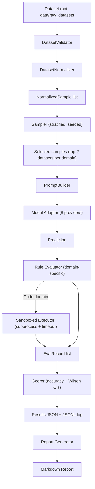

# Architecture

## High-Level Design

Modular LLM Scorer is a **production-ready benchmarking pipeline** with deterministic evaluation, statistical rigor, and multi-layer security:

1. Dataset ingestion and multi-format normalization
2. Deterministic stratified sampling with configurable seeds
3. Domain-specific prompting with refusal prevention
4. Rule-based evaluation with sandboxed code execution
5. Statistical scoring with 95% Wilson score confidence intervals
6. Comprehensive analysis, comparison, and reporting tools

All grading is deterministic — no LLM-as-judge is used.

---

## Component Diagram



---

## Runtime Entrypoints

- **CLI**: `run_benchmark.py` — main benchmark runner with `--compare`, `--dry-run`, `--domain` support
- **Programmatic API**: `Benchmark` class in `benchmark_lib/benchmark.py`
- **Analysis tools**: `analyze_errors.py`, `save_sample_list.py`, `mcnemar_test.py`, `generate_report.py`, `validate_pipeline.py`

---

## Package Structure

### `benchmark_lib/dataset/` — Validation, Normalization, Difficulty

| File | Responsibility |
|---|---|
| `validator.py` | Checks dataset root path; warns on unknown/missing folders; lists supported dataset names |
| `normalizer.py` | Loads HF disk datasets, JSON, JSONL, CSV, SQuAD v2 JSON → produces `NormalizedSample` objects |
| `difficulty.py` | Tags each sample `easy` / `medium` / `hard` using domain-specific heuristics |

### `benchmark_lib/engine/` — Sampling, Prompting, Inference, Evaluation, Scoring

| File | Responsibility |
|---|---|
| `benchmark.py` | Orchestrates the full pipeline end-to-end |
| `sampler.py` | Deterministic stratified sampling — top-2 datasets per domain, difficulty ratios |
| `prompt_builder.py` | Domain-specific prompt templates with refusal-blocking system instructions |
| `runner.py` | Inference loop — SHA-256 cache, retry with backoff, timing, JSONL logging |
| `evaluator.py` | Rule-based graders for math, logic, knowledge, and code; refusal detection |
| `scorer.py` | Aggregates `EvalRecord` list → JSON results with CIs, error breakdown, timing |
| `sandboxed_eval.py` | Multi-layer code execution safety (pattern validation, subprocess isolation, timeout) |

### `benchmark_lib/models/` — Provider-Agnostic Model Interface

| File | Provider |
|---|---|
| `base_model.py` | Abstract base: `generate(prompt, max_tokens) -> str`, optional `get_last_cost()` |
| `openai_model.py` | OpenAI chat completions |
| `openrouter_model.py` | OpenRouter chat completions; retries on token-pressure errors |
| `local_model.py` | OpenAI-compatible local endpoint + Ollama-native `/api/chat` fallback |
| `huggingface_model.py` | Local `transformers` or HF Inference API; auto-fallback to chat completions |
| `gemini_model.py` | Google Gemini; endpoint probe + preflight model check |
| `together_model.py` | Together AI; retry/backoff |
| `groq_model.py` | Groq; local RPM/TPM rate window throttling |
| `_rate_limit.py` | Shared rate-limiting utilities |

### `benchmark_lib/utils/` — Shared Utilities

| File | Responsibility |
|---|---|
| `types.py` | `NormalizedSample` and `EvalRecord` dataclasses |
| `cache.py` | SHA-256 prompt → response cache; stale entries are re-validated before reuse |
| `logging.py` | Logger setup (INFO level, timestamp/name formatting) |

### Top-Level Analysis & Reporting Scripts

| File | Purpose |
|---|---|
| `run_benchmark.py` | CLI entry point — benchmark, compare, dry-run, multi-seed aggregation |
| `analyze_errors.py` | Categorizes failures from JSONL into 8 error types; per-domain frequency table |
| `generate_report.py` | Markdown report with domain breakdown, timing, CIs, and executive summary |
| `save_sample_list.py` | Extracts evaluated samples from JSONL with full metadata |
| `mcnemar_test.py` | Standalone McNemar's chi-squared test from two JSONL logs |
| `validate_pipeline.py` | Evaluator correctness test suite: 43 test cases, 100% pass rate |

---

## Primary Data Contracts

### `NormalizedSample` (`benchmark_lib/utils/types.py`)

Canonical benchmark sample produced by the normalizer and consumed by the pipeline:

| Field | Type | Description |
|---|---|---|
| `id` | `str` | Unique identifier (`{dataset}-{index}`) |
| `dataset` | `str` | Source dataset name (e.g. `gsm8k_main`) |
| `domain` | `str` | `math`, `logic`, `knowledge`, or `code` |
| `question` | `str` | The prompt/question text |
| `answer` | `str` | Ground-truth answer |
| `options` | `list[str] \| None` | MCQ options (logic domain) |
| `difficulty` | `str` | `easy`, `medium`, or `hard` |
| `metadata` | `dict` | Domain-specific extras (aliases, test cases, entry_point, etc.) |

### `EvalRecord` (`benchmark_lib/utils/types.py`)

Per-sample evaluation result produced by the runner:

| Field | Type | Description |
|---|---|---|
| `sample_id` | `str` | Matches `NormalizedSample.id` |
| `dataset` | `str` | Source dataset |
| `domain` | `str` | Domain |
| `difficulty` | `str` | Difficulty tier |
| `prompt` | `str` | Full prompt sent to the model |
| `prediction` | `str` | Raw model output |
| `expected` | `str` | Ground-truth answer |
| `correct` | `bool` | Whether prediction is correct |
| `error` | `str \| None` | Error message or error code if failed |
| `error_type` | `str \| None` | Structured type: `generation_failure`, `format_error`, `wrong_answer`, `execution_error` |
| `cost` | `float` | API cost (where available) |
| `elapsed_seconds` | `float` | Inference time in seconds |
| `input_tokens` | `int` | Input token count |
| `output_tokens` | `int` | Output token count |

---

## Determinism Strategy

- **Seeded RNG**: configurable via `--seed` / `--seeds`
- **Explicit mode sizes**: `quick`=500, `half`=1500, `full`=6000
- **Explicit domain weights**: math=0.25, logic=0.25, knowledge=0.35, code=0.15
- **Fixed difficulty ratios**: 30% easy / 50% medium / 20% hard (best-effort within each dataset)
- **Top-2 dataset selection**: ranked by descending sample count; tie-breaker = dataset name
- **Deterministic evaluation**: no LLM grading; all rules are bounded and reproducible
- **Prompt logging**: full prompt text stored in JSONL for audit and replication

---

## Statistical Methods

### Confidence Intervals — Wilson Score

Applied per domain, difficulty tier, and dataset:

$$\text{CI}_{95\%} = \frac{\hat{p} + \frac{z^2}{2n} \pm z\sqrt{\frac{\hat{p}(1-\hat{p})}{n} + \frac{z^2}{4n^2}}}{1 + \frac{z^2}{n}}$$

- $\hat{p}$ = accuracy (proportion correct)
- $n$ = sample count
- $z = 1.96$ (95% confidence level)
- Handles edge cases (0% and 100% accuracy) correctly, unlike the normal approximation

**Implementation**: `benchmark_lib/engine/scorer.py` via `scipy.stats.proportion_confint(method='wilson')`

### McNemar's Test — Model Comparison

For paired evaluation on the same sample set:

$$\chi^2 = \frac{(|b - c| - 1)^2}{b + c}$$

- $b$ = samples where Model 1 is correct and Model 2 is wrong
- $c$ = samples where Model 2 is correct and Model 1 is wrong
- Significance threshold: $\alpha = 0.05$; requires ≥25 disagreements for reliable results

**Implementation**: `mcnemar_test.py` (standalone) and `run_benchmark.py --compare` (integrated)

---

## Domain Model

| Domain | Weight | Datasets |
|---|---|---|
| **Math** | 25% | `gsm8k_main`, `gsm8k_socratic`, `hendrycks_math_*`, `svamp` |
| **Logic** | 25% | `proofwriter`, `reclor` |
| **Knowledge** | 35% | `squad`, `natural_questions`, `trivia_qa` |
| **Code** | 15% | `openai_humaneval`, `mbpp_full`, `mbpp_sanitized` |

**Final score formula**:
```
final_score = Σ (domain_accuracy[d] × domain_weight[d])
              for d in {math, logic, knowledge, code}
```

---

## Security & Sandboxing

### Code Execution — 3-Layer Protection

1. **Pattern validation** (`validate_code_safety`) — blocks `exec`, `eval`, `open`, file operations, `os.system`, `subprocess` imports, and shell commands before execution
2. **Subprocess isolation** — candidate code runs in a separate `subprocess.run()` process, not in the main Python process
3. **Configurable timeout** — default 10 seconds per test run; exceeded runs return `code-timeout` error

### Implementation

- File: `benchmark_lib/engine/sandboxed_eval.py`
- Called from: `benchmark_lib/engine/evaluator.py` when `ENABLE_SANDBOXED_EVAL = True`
- `SANDBOX_STRICT_MODE = False` (default): standard restrictions
- `SANDBOX_STRICT_MODE = True`: additional restriction layer for tighter security
- Timeout handling with graceful `code-timeout` error (does not crash the pipeline)

### Limitations

- Pattern-based, not bytecode-level (unlike RestrictedPython)
- Subprocess isolation prevents parent process compromise but not all resource exhaustion
- See [Limitations and Notes](./limitations-and-notes.md) for details
